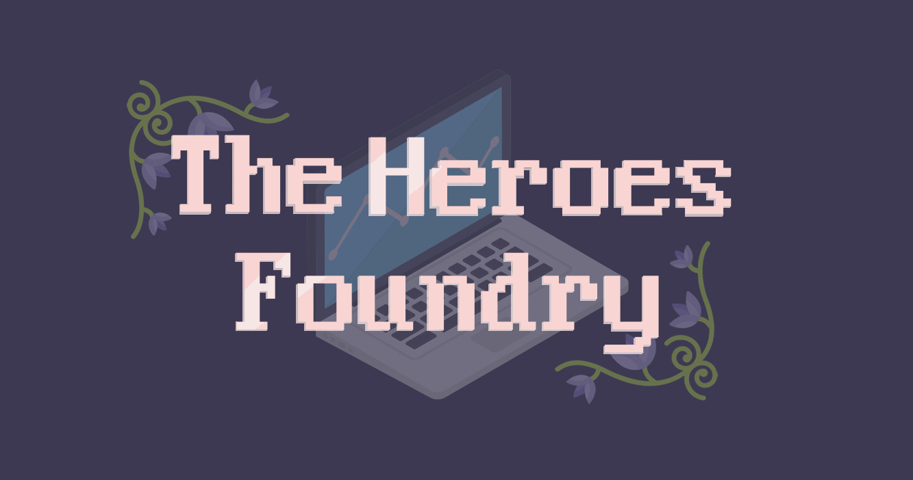

# Mise en place du projet JDR
## Projet de fin de formation AJC pour SopraSteria

### Resumé

Dans le cadre de notre Préparation Opérationnelle à l'Emploi Individuelle encadrée par AJC, un projet de fin de formation nous a été demandé pour valider nos acquis.
Dans notre groupe composé de Adil L., Ammiot M., Ferreira M. et Jacquet G., notre projet se base sur la gestion d'un Jeu de Rôle nommé **The Heroes Foundry**.
Basé sur le jeu pionnier dans le domaine *Dungeons and Dragons*, les joueur.se.s de The Heroes Foundry peuvent modeler leurs personnages de la façon dont ils.elles le souhaitent grâce à une très grande variété de choix. En effet, le joueur pourra choisir pour ses personnages :
..*les caractéristiques
..*les statistiques
..*le métier
..*le stuff
..*et bien plus encore !

Pour pouvoir commencer à créer ses fiches, rien de plus simple : il suffit de créer via notre interface web un compte joueur auquel sera relié toutes les créations du joueur !

**Rejoignez dès maintenant la communauté de The Heroes Foundy**

/!\ Toutes les id sont des Long

CTRL + Maj + C => Commenter la selection \o/
